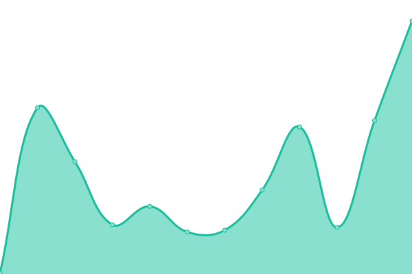

# [📈 Live Status](https://hinterland-software.github.io/uptime): <!--live status--> **🟩 All systems operational**

This repository contains the open-source uptime monitor and status page for [HINTERLAND software](https://hinterland.software), powered by [Upptime](https://github.com/upptime/upptime).

With [Upptime](https://upptime.js.org), you can get your own unlimited and free uptime monitor and status page, powered entirely by a GitHub repository. We use [Issues](https://github.com/hinterland-software/uptime/issues) as incident reports, [Actions](https://github.com/hinterland-software/uptime/actions) as uptime monitors, and [Pages](https://hinterland-software.github.io/uptime) for the status page.

<!--start: status pages-->
<!-- This summary is generated by Upptime (https://github.com/upptime/upptime) -->
<!-- Do not edit this manually, your changes will be overwritten -->
<!-- prettier-ignore -->
| URL | Status | History | Response Time | Uptime |
| --- | ------ | ------- | ------------- | ------ |
|  [hansekai-apartments](https://hansekai-apartments.de) | 🟩 Up | [hansekai-apartments.yml](https://github.com/HINTERLAND-software/uptime/commits/HEAD/history/hansekai-apartments.yml) | 

 632ms
     
 | 

<a href="https://hinterland-software.github.io/uptime/history/hansekai-apartments">100.00%</a>
    

|  [arianna-musikerviertel](http://arianna-musikerviertel.de/) | 🟩 Up | [arianna-musikerviertel.yml](https://github.com/HINTERLAND-software/uptime/commits/HEAD/history/arianna-musikerviertel.yml) | 

 1763ms
     
 | 

<a href="https://hinterland-software.github.io/uptime/history/arianna-musikerviertel">100.00%</a>
    

|  [wakenitzmauer-luebeck](https://wakenitzmauer-luebeck.de) | 🟩 Up | [wakenitzmauer-luebeck.yml](https://github.com/HINTERLAND-software/uptime/commits/HEAD/history/wakenitzmauer-luebeck.yml) | 

 410ms
     
 | 

<a href="https://hinterland-software.github.io/uptime/history/wakenitzmauer-luebeck">100.00%</a>
    

|  [carlaemrich](https://carlaemrich.de) | 🟩 Up | [carlaemrich.yml](https://github.com/HINTERLAND-software/uptime/commits/HEAD/history/carlaemrich.yml) | 

 928ms
     
 | 

<a href="https://hinterland-software.github.io/uptime/history/carlaemrich">100.00%</a>
    

|  [agenturgoeschen](https://agenturgoeschen.com) | 🟩 Up | [agenturgoeschen.yml](https://github.com/HINTERLAND-software/uptime/commits/HEAD/history/agenturgoeschen.yml) | 

 216ms
     
 | 

<a href="https://hinterland-software.github.io/uptime/history/agenturgoeschen">100.00%</a>
    

|  [strassburg-passage](https://strassburg-passage.de) | 🟩 Up | [strassburg-passage.yml](https://github.com/HINTERLAND-software/uptime/commits/HEAD/history/strassburg-passage.yml) | 

 833ms
     
 | 

<a href="https://hinterland-software.github.io/uptime/history/strassburg-passage">100.00%</a>
    

|  [ivm-meyer](https://ivm-meyer.de) | 🟩 Up | [ivm-meyer.yml](https://github.com/HINTERLAND-software/uptime/commits/HEAD/history/ivm-meyer.yml) | 

 376ms
     
 | 

<a href="https://hinterland-software.github.io/uptime/history/ivm-meyer">100.00%</a>
    

|  [bruecke-oh](https://bruecke-oh.de) | 🟩 Up | [bruecke-oh.yml](https://github.com/HINTERLAND-software/uptime/commits/HEAD/history/bruecke-oh.yml) | 

 685ms
     
 | 

<a href="https://hinterland-software.github.io/uptime/history/bruecke-oh">100.00%</a>
    

|  [heidpartner](https://heidpartner.de) | 🟩 Up | [heidpartner.yml](https://github.com/HINTERLAND-software/uptime/commits/HEAD/history/heidpartner.yml) | 

 1115ms
     
 | 

<a href="https://hinterland-software.github.io/uptime/history/heidpartner">100.00%</a>
    

|  [vh-gruppe](https://vh-gruppe.de) | 🟩 Up | [vh-gruppe.yml](https://github.com/HINTERLAND-software/uptime/commits/HEAD/history/vh-gruppe.yml) | 

 766ms
     
 | 

<a href="https://hinterland-software.github.io/uptime/history/vh-gruppe">100.00%</a>
    

|  [five-minutes](https://five-minutes.app) | 🟩 Up | [five-minutes.yml](https://github.com/HINTERLAND-software/uptime/commits/HEAD/history/five-minutes.yml) | 

 501ms
     
 | 

<a href="https://hinterland-software.github.io/uptime/history/five-minutes">100.00%</a>
    

|  [hinterland-software](https://hinterland.software) | 🟩 Up | [hinterland-software.yml](https://github.com/HINTERLAND-software/uptime/commits/HEAD/history/hinterland-software.yml) | 

 560ms
     
 | 

<a href="https://hinterland-software.github.io/uptime/history/hinterland-software">100.00%</a>
    

|  [linkedin-portfolio](https://johannroehl.de) | 🟩 Up | [linkedin-portfolio.yml](https://github.com/HINTERLAND-software/uptime/commits/HEAD/history/linkedin-portfolio.yml) | 

 575ms
     
 | 

<a href="https://hinterland-software.github.io/uptime/history/linkedin-portfolio">100.00%</a>
    

|  [cv-gen](https://cv.johannroehl.de) | 🟩 Up | [cv-gen.yml](https://github.com/HINTERLAND-software/uptime/commits/HEAD/history/cv-gen.yml) | 

 422ms
     
 | 

<a href="https://hinterland-software.github.io/uptime/history/cv-gen">100.00%</a>
    

|  [contentful-gatsby-boilerplate](http://contentful-gatsby-boilerplate.netlify.app) | 🟩 Up | [contentful-gatsby-boilerplate.yml](https://github.com/HINTERLAND-software/uptime/commits/HEAD/history/contentful-gatsby-boilerplate.yml) | 

 222ms
     
 | 

<a href="https://hinterland-software.github.io/uptime/history/contentful-gatsby-boilerplate">100.00%</a>
    

<!--end: status pages-->

[**Visit our status website →**](https://hinterland-software.github.io/uptime)

## 📄 License

- Powered by: [Upptime](https://github.com/upptime/upptime)
- Code: [MIT](./LICENSE) © [HINTERLAND software](https://hinterland.software)
- Data in the `./history` directory: [Open Database License](https://opendatacommons.org/licenses/odbl/1-0/)
